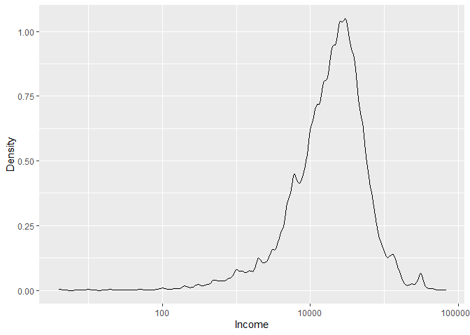
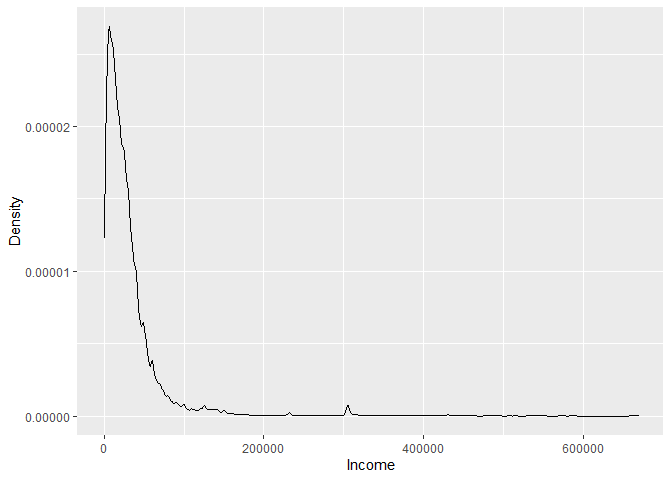

# A Review of Statistics 

**Acknowledgement:** This chapter is largely based on  chapter 3 of "Introduction to Econometrics with R". https://www.econometrics-with-r.org/index.html

The goal of this chapter is 

1. Review of important concepts in statistics
    1. Estimation
    2. Hypothesis testing
2. Review of tools from probability theory
    1. Law of large numbers
    2. Central limit theorem

## Estimation 

- Estimator: A mapping from the sample data drawn from an unknown population to a certain feature in the population
- Example: Consider hourly earnings of college graduates $Y$ .
- You want to estimate the mean of $Y$, defined as $E[Y] = \mu_y$ 
- Draw a random sample of $n$ i.i.d. (identically and independently distributed) observations ${ Y_1, Y_2, \ldots, Y_N }$
- How to estimate $E[Y]$ from the data?
- Idea 1: Sample mean 
\[ 
  \bar{Y} = \frac{1}{n} \sum_{i=1}^n Y_i, 
\]
- Idea 2: Pick the first observation of the sample. 
- Question: How can we say which is better?

### Properties of the estimator

Consider the estimator $\hat{\mu}_N$ for the unknown parameter $\mu$. 

1. Unbiasdeness: The expectation of the estimator is the same as the true parameter in the population. 
\[
  E[\hat{\mu}_N] = \mu
\]

2. Consistency: The estimator converges to the true parameter in probability. 
\[
\forall \epsilon >0, \lim_{N \rightarrow \infty} \ Prob(|\hat{\mu}_{N}-\mu|<\epsilon)=1
\]
    - Intuition: As the sample size gets larger, the estimator and the true parameter is close with probability one. 
    - Note: a bit different from the usual convergence of the sequence. 
    

### Sample mean $\bar{Y}$ is unbiased and consistent

- Showing these two properties using mathmaetics is straightforward:
    - Unbiasedness: Take expectation.
    - Consistency: Law of large numbers. 
- Let's examine these two properties using R. 

- Step 1: Prepare a population. Here, I prepare income and age data from PUMS 5% sample of U.S. Census 2000.
    - PUMS: Public Use Microdata Sample 
    - [Download the example data here as a .csv file.](data_pums_2000.csv) Put this file in the same folder as your R script file. 


```r
# Use "readr" package
library(readr)
pums2000 <- read_csv("data_pums_2000.csv") 
```

```
## Parsed with column specification:
## cols(
##   AGE = col_double(),
##   INCTOT = col_double()
## )
```

- We treat this dataset as **population**.

```r
pop <- as.vector(pums2000$INCTOT)
```

- *Population* mean and standard deviation 

```r
pop_mean = mean(pop)
pop_sd   = sd(pop)

# Average income in population
pop_mean
```

```
## [1] 30165.47
```

```r
# Standard deviation of income in population
pop_sd
```

```
## [1] 38306.17
```

```r
# income distribution in population
# Note that the unit is in USD.
library("ggplot2")
```

```
## Warning: package 'ggplot2' was built under R version 3.6.3
```

```r
qplot(pop, geom = "density", 
      xlab = "Income",
      ylab = "Density")
```

<!-- -->

- The distribution has a long tail.
- Let's plot the distribution in *log* scale


```r
# `log` option specifies which axis is represented in log scale.
qplot(pop, geom = "density", 
      xlab = "Income",
      ylab = "Density",
      log = "x")
```

<!-- -->


- Let's investigate how close the sample mean constucted from the random sample is to the true population mean. 
- Step 1: Draw random sample*s* from this population and calculate $\bar{Y}$ for each sample.
    - Set the sample size $N$. 
- Step 2: Repeat 2000 times. You now have 2000 sample means.


```r
# Set the seed for the random number. This is needed to maintaine the reproducibility of the results.
set.seed(123)

# draw random sample of 100 observations from the variable pop
test <- sample(x = pop, size = 100)

# Use loop to repeat 2000 times. 
Nsamples = 2000
result1 <- numeric(Nsamples)

for (i in 1:Nsamples ){
  
  test <- sample(x = pop, size = 100)
  result1[i] <- mean(test)
  
}

# Simple approach
result1 <- replicate(expr = mean(sample(x = pop, size = 10)), n = Nsamples)
result2 <- replicate(expr = mean(sample(x = pop, size = 100)), n = Nsamples)
result3 <- replicate(expr = mean(sample(x = pop, size = 500)), n = Nsamples)

# Create dataframe

result_data <- data.frame(  Ybar10 = result1, 
                            Ybar100 = result2, 
                            Ybar500 = result3)
```

- Step 3: See the distribution of those 2000 sample means. 


```r
# Use reshape library
# install.packages("reshape")
library("reshape")
```

```
## Warning: package 'reshape' was built under R version 3.6.3
```

```r
# Use "melt" to change the format of result_data
data_for_plot <- melt(data = result_data, variable.name = "Variable" )
```

```
## Using  as id variables
```

```r
# Use "ggplot2" to create the figure.
# The variable `fig` contains the information about the figure
fig <- 
  ggplot(data = data_for_plot) +
  xlab("Sample mean") + 
  geom_line(aes(x = value, colour = variable ),   stat = "density" ) + 
  geom_vline(xintercept=pop_mean ,colour="black")

# Display the figure 
plot(fig)
```

<!-- -->

- Observation 1: Regardless of the sample size, the average of the sample means is close to the population mean. **Unbiasdeness**
- Observation 2: As the sample size gets larger, the distribution is concentrated around the population mean. **Consistency (law of large numbers)**

## Hypothesis Testing

### Central limit theorem

- Cental limit theorem: Consider the i.i.d. sample of $Y_1,\cdots, Y_N$ drawn from the random variable $Y$ with mean $\mu$ and variance $\sigma^2$. The following $Z$ converges in distribution to the normal distribution.
\[
Z = \frac{1}{\sqrt{N}} \sum_{i=1}^N \frac{Y_i - \mu}{\sigma } \overset{d}{\rightarrow}N(0,1)
\]
In other words, 
\[
\lim_{N\rightarrow\infty}P\left(Z \leq z\right)=\Phi(z)
\]

- The central limit theorem implies that if $N$ is large **enough**, we can **approximate** the distribution of $\bar{Y}$ by the standard normal distribution with mean $\mu$ and variance $\sigma^2 / N$ **regardless of the underlying distribution of $Y$.**  

- Let's examine this property through simulation!!

- Use the same example as before. Remember that the underlying income distribution is clearly NOT normal. 
    - Population mean $\mu = 30165.4673315$ and standard deviation $\sigma = 38306.1712336$. Use these numbers. 
    
    

```r
# Set the seed for the random number
set.seed(124)

# define function for simulation 
f_simu_CLT = function(Nsamples, samplesize, pop, pop_mean, pop_sd ){
  
  output = numeric(Nsamples)
  for (i in 1:Nsamples ){
    test <- sample(x = pop, size = samplesize)
    output[i] <- ( mean(test) - pop_mean ) / (pop_sd / sqrt(samplesize))
  }
  
  return(output)

}

# Comment: You can do better without using forloop. Let me know if you come with a good idea.

# Run simulation 
Nsamples = 2000
result_CLT1 <- f_simu_CLT(Nsamples, 10, pop, pop_mean, pop_sd )
result_CLT2 <- f_simu_CLT(Nsamples, 100, pop, pop_mean, pop_sd )
result_CLT3 <- f_simu_CLT(Nsamples, 1000, pop, pop_mean, pop_sd )

# Random draw from standard normal distribution as comparison
result_stdnorm = rnorm(Nsamples)

# Create dataframe
result_CLT_data <- data.frame(  Ybar_standardized_10 = result_CLT1, 
                            Ybar_standardized_100 = result_CLT2, 
                            Ybar_standardized_1000 = result_CLT3, 
                            Standard_Normal = result_stdnorm)

# Note: If you wanna quicky plot the density, type `plot(density(result1))`. 
```


- Now take a look at the distribution. 


```r
# Use "melt" to change the format of result_data
data_for_plot <- melt(data = result_CLT_data, variable.name = "Variable" )
```

```
## Using  as id variables
```

```r
# Use "ggplot2" to create the figure.
fig <- 
  ggplot(data = data_for_plot) +
  xlab("Sample mean") + 
  geom_line(aes(x = value, colour = variable ),   stat = "density" ) + 
  geom_vline(xintercept=0 ,colour="black")

plot(fig)
```

<!-- -->

- As the sample size grows, the distribution of $Z$ converges to the standard normal distribution.

### Hypothesis testing

To be added. 


