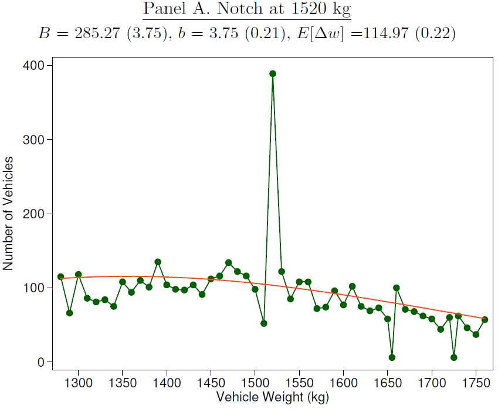
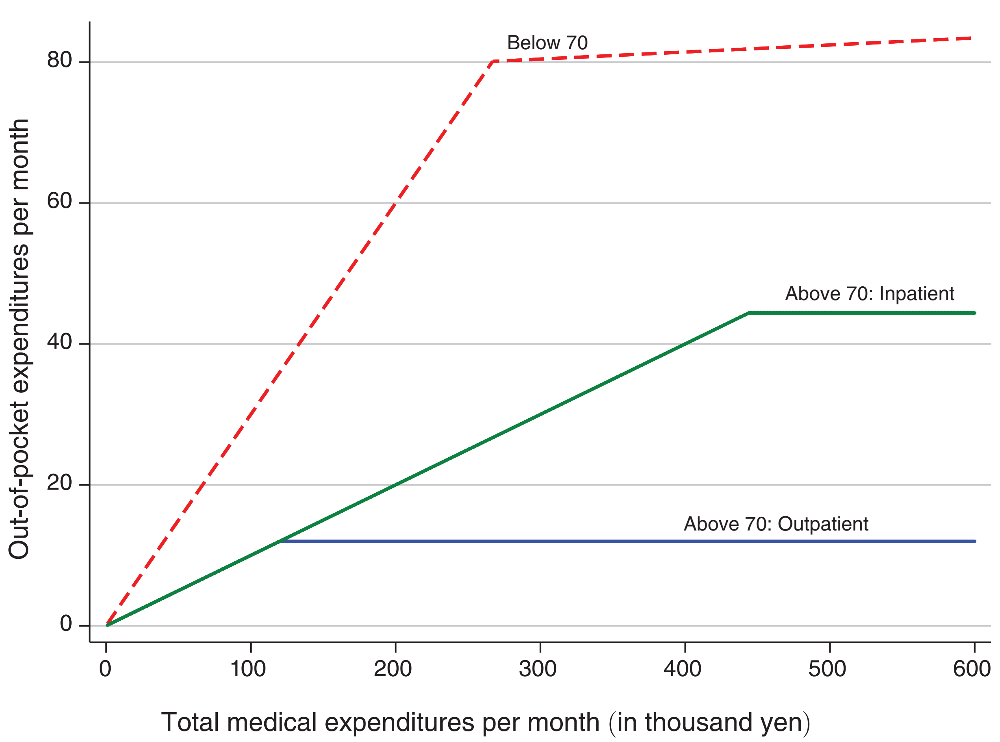
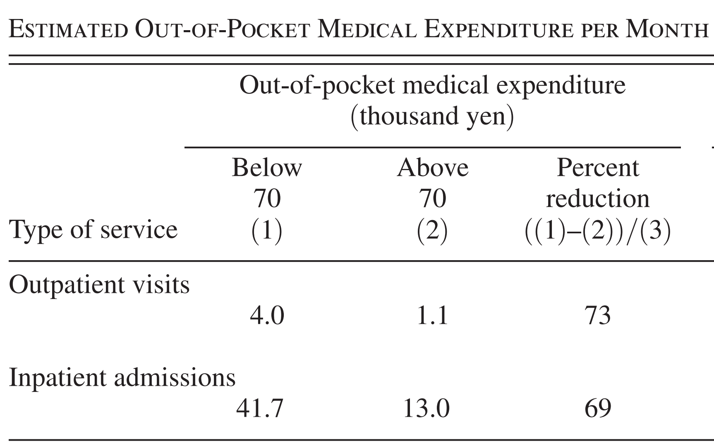
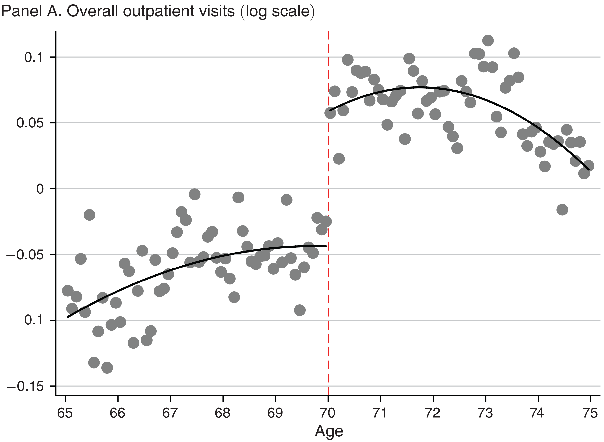
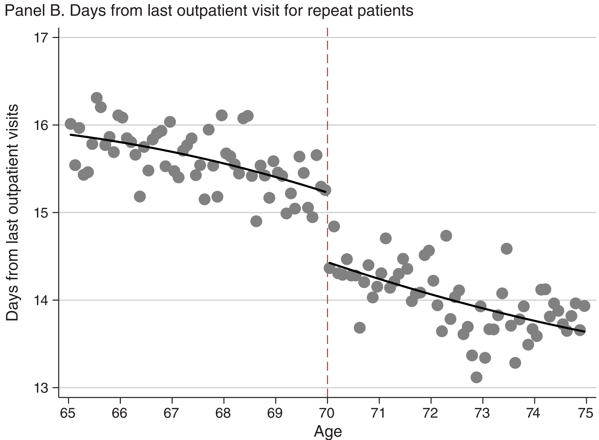
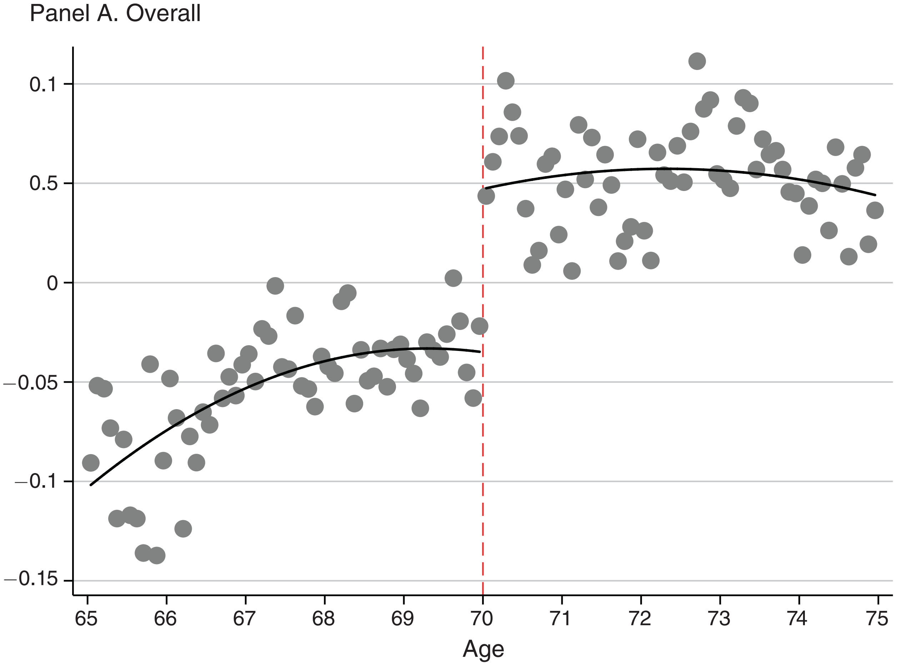
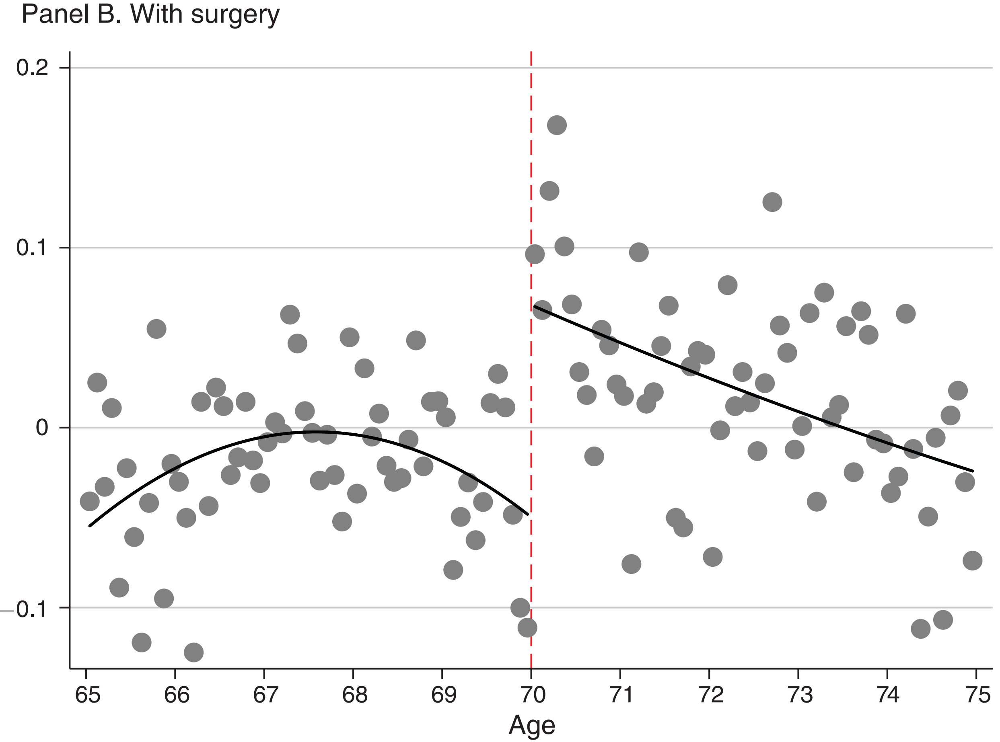
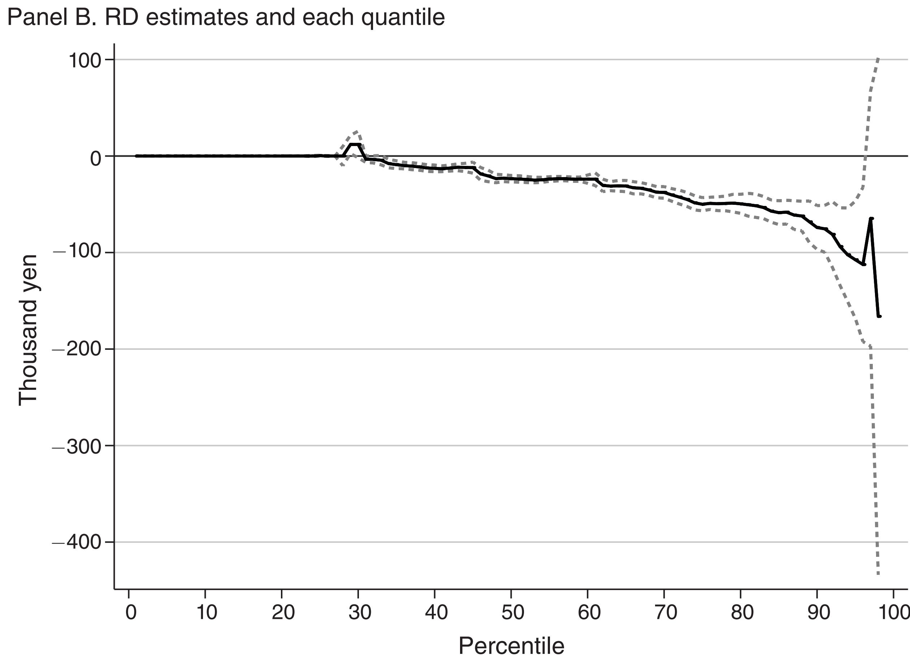

# Introduction

## Introduction

-   Regression Discontinuity Design
    -   Exploit the discontinuous change in treatment status to estimate
        the causal effect.
\bigskip
-   Example:
    -   Threshold of test score for college admission
    -   Eligibility of policy due to age.
    -   Geographic boundary of two regions.
\bigskip
-   Pros: Strong internal validity
    -   Assumption for identification is weak.
\bigskip
-   Cons: Very little external validity
    -   What we estimate is the effect on people at the boundary.

## Idea in Figure

## Reference

-   Angrist and Pischke "Mostly harmless econometrics" Chapter 6
\bigskip
-   R packages:
    [https://sites.google.com/site/rdpackages/rdrobust ](https://sites.google.com/site/rdpackages/rdrobust )

# Framework

## Framework

-   $Y_{i}$: observed outcome for person $i$
\bigskip
-   Define *potential outcomes*
    -   $Y_{1i}$: outcome for $i$ when she is treated (treatment group)
    -   $Y_{0i}$: outcome for $i$ when she is not treated (control
        group)
\bigskip
-   $D_{i}$: treatment status is deterministically determined (sharp RD
    design) $$D_{i}=\mathbf{1}\{W_{i}\geq\bar{W}\}$$
    -   $W_{i}$: running variable (forcing variable).
    -   Probabilistic assignment is allowed (**fuzzy RD design**)

## Example: Incumbent Advantage

-   Consider the two-candidate elections
    -   $D_{i}$: dummy for incumbent in the election
    -   $Y_{i}$: whether the candidate win in the election
    -   $W_{i}:$ the vote share in the previous election.
\bigskip
-   The incumbent status is defined as
    $$D_{i}=\mathbf{1}\{W_{i}\geq0.5\}$$
\bigskip
-   Idea of RD:
    -   Suppose that you won with 51%.
    -   You are similar to the guy who lose at 49% (main assumption of
        RD).
    -   If you focus on these people, $D_{i}$ is as if it were randomly
        assigned.

## Framework cont.d
-   Note that $D_{i}=\mathbf{1}\{W_{i}\geq\bar{W}\}$ implies the
    unconfoundedness $$(Y_{1i},Y_{0i})\perp D_{i}|W_{i}$$
\bigskip
-   But the overlap assumption does not hold
    $$P(D_{i}=1|W_{i}=w)=\begin{cases}
    1 & if\ w\geq\bar{W}\\
    0 & if\ w<\bar{W}
    \end{cases}$$
\bigskip
-   To compare people with and without treatment, we need to rely on
    some sort of extrapolation around the threshold.

## Linear approach

-   Suppose for a moment that $$\begin{aligned}
    Y_{1i} & =\rho+Y_{0i}\\
    E[Y_{0i}|W_{i}=w] & =\alpha_{0}+\beta_{0}w\end{aligned}$$
\bigskip
-   This leads to a regression
    $$Y_{i}=\alpha+\beta W_{i}+\rho D_{i}+\eta_{i}$$
    -   $\rho$ is the causal effect.
\bigskip
-   This approach relies on linear extrapolation. May not be good.
    -   What if $E[Y_{0i}|W_{i}=w]$ is nonlinear?

---

---

## A more general approach

-   Allowing for nonlinear effect of the running variable $W_{i}$
    $$Y_{i}=f(W_{i})+\rho\mathbf{1}\{W_{i}\geq\bar{W}\}+\eta_{i}$$
\bigskip
-   A function $f(\cdot)$ might be a $p$th order polynomial.
    $$f(W_{i})=\beta_{1}W_{i}+\beta_{2}W_{i}^{2}+\cdots+\beta_{p}W_{i}^{p}$$

    -   nonparametric approach later.

## Implementation in Regression

-   Consider $$\begin{aligned}
    E[Y_{0i}|W_{i}=w] & =f_{0}(W_{i}-\bar{W})\\
    E[Y_{1i}|W_{i}=w] & =\rho+f_{1}(W_{i}-\bar{W})\end{aligned}$$
    -   $\tilde{W}_{i}=W_{i}-\bar{W}$ is a normalization.
\bigskip
-   Then the regression equation is (See page 255 in Angrist and
    Pischke) $$\begin{aligned}
    Y_{i} & =\alpha+\beta_{01}\tilde{W_{i}}+\cdots+\beta_{0p}\tilde{W}_{i}^{p}\\
     & +\rho D_{i}+\beta_{1}^{*}D_{i}\tilde{W}_{i}+\cdots+\beta_{p}^{*}D_{i}\tilde{W}_{i}^{p}+\eta_{i}\end{aligned}$$
    -   $\rho$ is the causal effect.
\bigskip
-   When running regression, need to focus on the sample around
    threshold.
    -   How close the sample should be to the threshold can be taken
        care by statistical procedure.

# Example

## Mastering Metrics Sec 4.1: Effects of the minimum age drinking law

---

---

---

# Formal Analysis

## Formal Identification Analysis

-   Key: continuity assumptions: Both $E[Y_{1i}|W_{i}=w]$ and
    $E[Y_{0i}|W_{i}=w]$ are continuous at the threshold $w=\bar{W}$.
    -   This is not directly testable assumption (because we cannot
        observe $Y_{1i}$ below the threshold).
    -   Will discuss several validating approaches.
-   To see how this works, notice that $$\begin{aligned}
    E[Y_{i}|W_{i}=w]= & E[Y_{0i}|W_{i}=w]\\
     & +\mathbf{1}\{w\geq\bar{W}\}\left(E[Y_{1i}|W_{i}=w]-E[Y_{0i}|W_{i}=w]\right)\end{aligned}$$
-   Taking the limit of $w$ to $\bar{W}$ from above and below
    $$\begin{aligned}
    \lim_{w\uparrow\bar{W}}E[Y_{i}|W_{i} & =w]=\lim_{w\uparrow\bar{W}}E[Y_{0i}|W_{i}=w]=E[Y_{0i}|W_{i}=\bar{W}]\\
    \lim_{w\downarrow\bar{W}}E[Y_{i}|W_{i} & =w]=\lim_{w\downarrow\bar{W}}E[Y_{1i}|W_{i}=w]=E[Y_{1i}|W_{i}=\bar{W}]\end{aligned}$$
    -   Notice that we use continuity in the second equalities!

---

-   Remember that $$\begin{aligned}
    \lim_{w\uparrow\bar{W}}E[Y_{i}|W_{i} & =w]=\lim_{w\uparrow\bar{W}}E[Y_{0i}|W_{i}=w]=E[Y_{0i}|W_{i}=\bar{W}]\\
    \lim_{w\downarrow\bar{W}}E[Y_{i}|W_{i} & =w]=\lim_{w\downarrow\bar{W}}E[Y_{1i}|W_{i}=w]=E[Y_{1i}|W_{i}=\bar{W}]\end{aligned}$$
\bigskip
-   So, we have
    $$E[Y_{1i}-Y_{0i}|W_{i}=\bar{W}]=\lim_{w\downarrow\bar{W}}E[Y_{i}|W_{i}=w]-\lim_{w\uparrow\bar{W}}E[Y_{i}|W_{i}=w]$$
    -   LHS: Average treatment effect at the threshold
    -   RHS: We can observe from the data.
        -   Conditional expectation near the threshold.

# Validation of Assumptions

## Validation of Assumptions

-   The key assumptions : Both $E[Y_{1i}|W_{i}=w]$ and
    $E[Y_{0i}|W_{i}=w]$ are continuous at the threshold $w=\bar{W}$.
\bigskip
-   This is not directly testable because we cannot observe $Y_{1i}$
    below the threshold.
\bigskip
-   There are two common approaches that support this assumption:
    1.  Covariate test
    2.  Density test (no bunching in the running variable).

## Covariate Test

-   The underlying idea of RDD: Comparing outcomes right above and right
    below $\bar{W}$ provides a comparison of treated and control agents
    who are similar due to the assumed continuity in conditional
    distributions
\bigskip
-   If this is a valid comparison, then we would expect that covariates
    $X$ also change smoothly as we pass through the threshold.

--- 

-   Run the RDD on the covariate $X$.
\bigskip
-   If we found the discontinuity, it suggests that the conditional
    expectation of $Y$ on $W$ may not be continuous either.
\bigskip
-   If $X$ has a direct effect on $Y$, the discontinuity in $E[Y_{i}|W]$
    at $\bar{W}$ will confound the treatment effect.
\bigskip
-   Example:
    -   $Y$ hours worked,
    -   $D$: older-than-65 discounts,
    -   $W$: age, $X$: social security benefit (non-work income)

## Density Test, or No Bunching

-   Manipulation if agents know about the institutional details
    -   If schools scoring lower than $w = 50$ on
        standardized tests get labeled as dysfunctional, we might see 
        many schools to be right above 50
\bigskip
-   In this case, we observe **bunching** around the threshold.
    -   Agents are "manipulating" treatment assignment around the
        threshold.
    -   Density of $W_{i}$ is discontinuous at $\bar{W}$
\bigskip
-   We would expect that $E[Y_{1i}|W_{i}=w]$ would be also
    discontinuous.
\bigskip
-   McCrary (2008) suggests a test of the null hypothesis that the
    density of $W_{i}$ is continuous at $\bar{W}$.

## Bunching Estimation

-   Bunching itself is an interesting economic phenomenon. It can
    be used to analyze a different question.
\bigskip 

## Example: Ito and Sallee (2018, REStat)

--- 

# Empirical Paper

## Empirical Paper: Health Demand

- "The Effect of Patient Cost Sharing on Utilization, Health, and
  Risk Protection" by Hitoshi Shigeoka 2014 AER'

## Policy Issue: Medical Expenditure

-   Medical expenditures are rising.
    -   due to an aging population and coverage expansion
    -   acute fiscal challenge to governments!
\bigskip
-   Current expenditure on health (to GDP) in 2018 according to OECD
    Health Statistics 2019
    -   U.S.A. (16.9%), Switzerland (12.2%), Germany (11.2%), France
        (11.2%), Sweden (11.0%), Japan (10.9%)\...
\bigskip
-   One main strategy is higher patient cost sharing, that is, requiring
    patients to pay a larger share of the cost of care.
\bigskip
-   Question: how does patient cost sharing affect
    -   utilization (demand elasticity)?
    -   health?
    -   risk protection (out-of-pocket expenditures)?

## Background and Cross-sectional Data

-   All Japanese citizens are mandatorily covered by health insurance.
\bigskip
-   Use a sharp reduction in cost sharing for patients aged over 70 in
    Japan.
\bigskip
-   The sources are the Patient Survey and the Comprehensive Survey of
    Living Conditions (CSLC). 1984-2008.
\bigskip
-   Advantages
    -   There are no confounding factors at age 70. We can isolate the
        effect of patient cost sharing.
    -   Medical providers do not have incentive to differentiate prices
        by the patients' insurance type.
    -   We can separate inpatient and outpatient.

## Cost Sharing and Out-of-Pocket Medical Expenditure

-   In sum, the proportion is 30% for \<69 and 10% for 70$\leq$.
\bigskip
-   Out-of-pocket medical expenditure for impatient admissions can reach
    27% for a 69-year-old.
\bigskip
-   However, for 70, it would be reduced to 8.6%.
\bigskip
-   We need to take the stop-loss into account.

## Identification Strategy

-   Standard RD designs.
\bigskip
-   Basic estimation equation for the CSLC is
    $$Y_{iat}=f(a)+\beta Post70_{iat}+X_{iat}^{\prime}\gamma+\varepsilon_{iat}.$$
    -   $Y_{iat}$: a measure of morbidity or out-of-pocket medical
        expenditure
    -   $f(a)$: a smooth function of age.
    -   $X_{iat}$: a set of individual covariates
    -   $Post70_{iat}$: $=0$ if individual $i$ is over 70.
\bigskip
-   Patient Survey/mortality data represents individuals who are present
    in the medical institutions/deceased.
\bigskip
-   As in Card, Dobkin, and Maestas (2004), basic estimation equation
    for the Patient Survey and mortality data is
    $$\log(Y_{at})=f(a)+\beta Post70_{at}+\mu_{at}.$$
\bigskip
-   We dealt with heaping, seasonality, and the catch-up effect.

## Results: Outpatient Visits

-   10.3% increase in overall visits. The implied elasticity is
    $-0.18$.
\bigskip
-   Sharp drop in the duration from the last visit by one day.
\bigskip
-   The effect is heterogeneous across institutions, genders, and
    diagnoses.

## Results: Inpatient Admissions

-   Left: 8.2% increase in overall admissions. The implied elasticity is
    $-0.16$.
\bigskip
-   Right: Surge (increase by 12.0%) in admissions with surgery.
\bigskip
-   From robustness checks, the implied elasticity is around $-0.2$.

##  Benefits: Health Outcomes

-   We cannot find significant discontinuity in mortality.
\bigskip
-   This result is expected because health is stock (Grossman 1972).
\bigskip
-   There is no discontinuity in morbidity (self-reported health).
\bigskip
-   The available health measures here are limited, so we would
    underestimate the benefit.

## Benefits: Risk Reduction

-   Another benefit is a lower risk of unexpected out-of-pocket medical
    spending.
\bigskip
-   We use a nonparametric estimator for quantile treatment effects.
\bigskip
-   Patients at the right tail of the distribution in particular are
    substantially benefited.

## Discussion

-   Price Elasticities
    -   We cannot distinguish own- from cross-price effects.
    -   However, for some diagnosis groups, cross-price effects should
        be nearly zero.
    -   The overall effect of the price change for the groups is an
        approximately 10 percent increase in visits.
\bigskip
-   Cost-Benefit Analysis
    -   Imposing many assumptions, we speculate that the welfare gain of
        risk protection from lower patient cost sharing is comparable to
        the total social cost.
    -   We cannot include welfare gains from health improvements.

